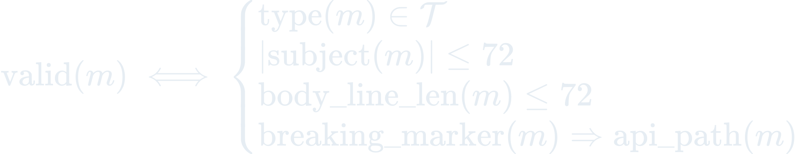
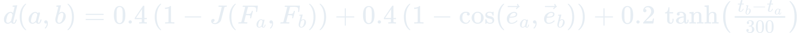
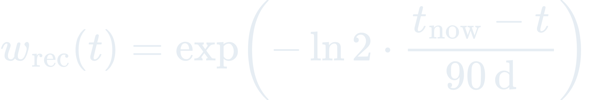

# The Science Behind Sylph

Formal mathematical models powering every git-flow engine in Sylph.

These aren't abstractions. Every formula maps to running code.

---

## W1. Myers-Diff Conventional Classifier

**Problem:** Draft a commit message from the current diff and validate it against the Conventional Commits 1.0 spec before push.

 api_path">

Two-stage pipeline. Stage 1 (Sonnet `commit-drafter` agent) generates `type(scope)!: subject\n\nbody` from `git status` and the diff (raw, or Crow-H1 compressed form when the diff exceeds 1500 tokens). Stage 2 (Haiku `message-validator`) checks against the 11 canonical types (feat, fix, docs, style, refactor, perf, test, build, ci, chore, revert), subject length, body wrap, breaking-change markers versus exported-API paths, and safe-amend (blocks amend on pushed commits). The pipeline never re-computes diffs — that cost lives upstream in Crow.

**Implementation:** `plugins/commit-intelligence/agents/{commit-drafter.md, message-validator.md}`, `shared/scripts/commit_classify.py`

---

## W2. Jaccard-Cosine Boundary Segmentation

**Problem:** Detect task boundaries from a stream of file-edit events so Sylph can auto-commit when work naturally completes.

 0.55">

Online agglomerative clustering over PostToolUse Edit/Write events. Each event contributes three signals: file-set overlap (Jaccard, α = 0.4), semantic vector similarity (cosine of Crow-H1 embeddings or stdlib bag-of-tokens with L2 norm, β = 0.4), and idle-time gap via `tanh(Δt / 300s)` (γ = 0.2). A cluster closes and fires a `sylph.task.boundary.detected` event when the next event exceeds θ = 0.55. Within the ±0.10 uncertainty band, the `boundary-detector` Opus agent gets called for judgment. Multi-signal design avoids the idle-timer-only failure that sank Graphite's 2023 auto-commit feature.

**Implementation:** `plugins/boundary-segmenter/agents/boundary-detector.md`, `shared/scripts/boundary_segment.py` (stdlib-only, ~1,200 lines)

---

## W3. Workflow-Pattern Classifier

**Problem:** Infer the active branching model from repo state so Sylph can auto-create branches per the team's convention.

W3 is a decision tree, not closed-form. Feature extraction: branch names and ages, protected-branch patterns, config markers (`.gitflow-config`, `.graphite_config`, `.sl/`, `.git/branchless`), and release cadence (median days between last 10 tags). Decision path: stacked-diffs (Graphite / Sapling / branchless markers) → gitflow (develop + release/* branches) → release-flow (release/* without develop, ≥ monthly cadence) → trunk-based (median branch age < 3 days, active set < 20) → github-flow (protected main + 3–14d feature branches) → unknown (no match). Monorepos can override per-subtree via CODEOWNERS or `.sylph/workflow-map.yaml`.

**Implementation:** `plugins/branch-workflow/skills/workflow-detection`, `shared/scripts/workflow_detect.py` (~1,800 lines)

---

## W4. Path-History Reviewer Routing

**Problem:** Route PR reviews to the most relevant maintainers using file history and CODEOWNERS.

For each changed file, pull the last 50 commits (`git log --format=%an%x09%ae%x09%at -- <file>`). Weight each author by recency (exponential decay, 90-day half-life) × path-depth specificity (deeper path matches outrank root-level authors). Union with CODEOWNERS entries (hard boost, no displacement). Filter by Crow availability events; cap at 3 reviewers to avoid reviewer storms. Per-host adapters: GitHub is first-class; GitLab, Bitbucket, Azure DevOps, Gitea, CodeCommit, SourceHut, Codeberg stub `NotImplementedHostOp`.

**Implementation:** `plugins/pr-lifecycle/skills/reviewer-router`, `shared/scripts/reviewer_route.py`, `shared/scripts/adapters/`

---

## W5. Gauss Learning (EMA Accumulation)

**Problem:** Track how a developer's preferences evolve across sessions to personalize defaults for W1, W3, and W4.

= 10">

Exponential moving averages with α = 0.3, tracked per developer across sessions:

- `commit_style`: scope_usage_rate, body_present_rate, avg_subject_length, top_scopes, type_frequencies
- `branch_naming`: slug_style, type_prefix_rate, user_prefix_rate
- `pr_turnaround`: median hours to first review, median to merge
- `reviewer_overrides`: manually added handles with weights
- `w2_corrections`: boundary split/merge counts

Bootstrap floor of 10 samples — below that, priors are ignored as low-confidence. Priors persist via Emu-A4 atomic serialization (tempfile + rename). Feeds learned defaults into W1 (commit drafting), W3 (workflow overrides), and W4 (reviewer weights). After ~6 weeks of active use, Sylph adapts to the developer's style.

**Implementation:** `plugins/sylph-learning/hooks/{session-start/load-priors.sh, pre-compact/checkpoint-learnings.sh}`, `shared/scripts/{gauss_learning.py, atomic_json.py}`

---

*Every formula maps to executable code in the enchanter-ai ecosystem. The math runs.*
